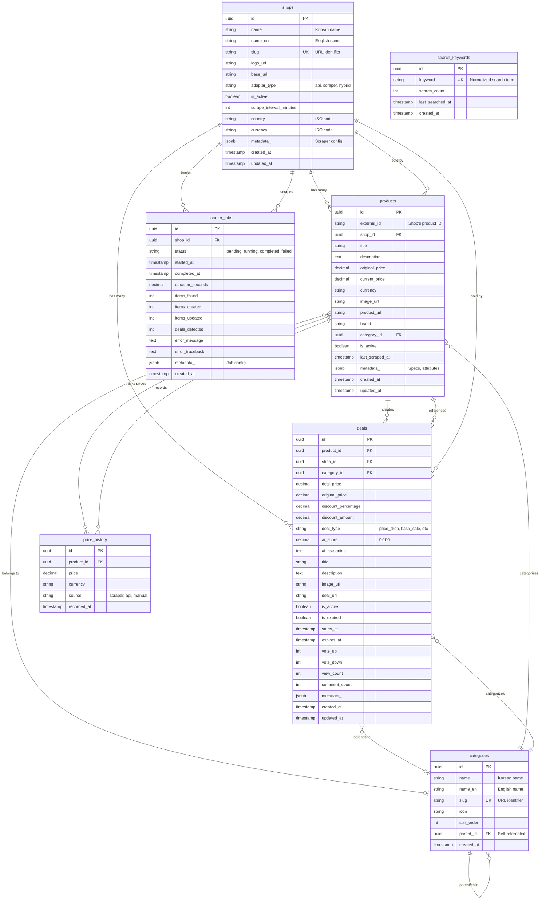

# DealHawk Database Schema

## Entity Relationship Diagram



## Key Relationships

### One-to-Many Relationships

1. **Shop → Products**
   - One shop has many products
   - Products are deleted when shop is deleted (CASCADE)

2. **Shop → Deals**
   - One shop has many deals
   - Deals are deleted when shop is deleted (CASCADE)

3. **Shop → Scraper Jobs**
   - One shop has many scraper job executions
   - Jobs are deleted when shop is deleted (CASCADE)

4. **Product → Price History**
   - One product has many price history records
   - Price history deleted when product is deleted (CASCADE)

5. **Product → Deals**
   - One product can have multiple deals (e.g., different time periods)
   - Deals deleted when product is deleted (CASCADE)

### Optional Relationships (SET NULL on delete)

1. **Category → Products**
   - Products can belong to a category
   - When category deleted, product.category_id → NULL

2. **Category → Deals**
   - Deals can belong to a category
   - When category deleted, deal.category_id → NULL

### Self-Referential Relationship

1. **Category → Category (parent/child)**
   - Categories can have parent categories
   - Enables hierarchical category tree
   - When parent deleted, children are also deleted (CASCADE)

## Indexes

### Primary Indexes (Automatic)

- `id` (UUID) on all tables

### Unique Indexes

- `shops.slug` - Ensures unique URL identifiers
- `categories.slug` - Ensures unique URL identifiers
- `(products.external_id, products.shop_id)` - One product per shop
- `search_keywords.keyword` - Unique keywords

### Performance Indexes

#### Text Search (Trigram GIN)
- `products.title` - Fuzzy search on product titles
- `deals.title` - Fuzzy search on deal titles

#### Foreign Key Indexes
- `products.shop_id`
- `products.category_id`
- `price_history.product_id`
- `deals.product_id`
- `deals.shop_id`
- `deals.category_id`
- `scraper_jobs.shop_id`

#### Composite Indexes
- `(products.is_active, products.last_scraped_at)` - Find stale products
- `(deals.is_active, deals.created_at)` - Recent active deals
- `(price_history.product_id, price_history.recorded_at)` - Time-series queries

#### Partial Indexes
- `deals.ai_score WHERE is_active = true` - Scored active deals only

#### Other Indexes
- `products.brand` - Filter by brand
- `scraper_jobs.status` - Monitor job status
- `search_keywords.last_searched_at` - Trending searches
- `deals.expires_at` - Find expiring deals
- `deals.vote_up` - Sort by popularity

## Data Types

### PostgreSQL-Specific Types

- **UUID**: Native PostgreSQL UUID type for all primary keys
- **JSONB**: Binary JSON storage for flexible metadata
- **Numeric(12, 2)**: Fixed-precision decimal for prices (12 digits, 2 decimal places)
- **Numeric(5, 2)**: For percentages and scores (0-100.00)
- **DateTime(timezone=True)**: Timezone-aware timestamps

### Conventions

- All timestamps use `server_default=func.now()` for consistency
- `updated_at` uses `onupdate=func.now()` for automatic updates
- JSONB columns named `metadata_` to avoid Python keyword conflict
- Boolean fields default to `False` unless otherwise specified
- Integer counters default to 0

## Constraints

### NOT NULL Constraints

Required fields that must always have a value:
- All `id`, `created_at` columns
- Shop: `name`, `name_en`, `slug`, `base_url`, `adapter_type`
- Product: `shop_id`, `title`, `product_url`
- Deal: `product_id`, `shop_id`, `deal_price`, `title`, `deal_url`
- Price History: `product_id`, `price`, `recorded_at`

### Unique Constraints

- Single column: `shops.slug`, `categories.slug`, `search_keywords.keyword`
- Multi-column: `(products.external_id, products.shop_id)`

### Foreign Key Constraints

All foreign keys use standard naming: `<table>_id` references `<table>.id`

#### CASCADE Deletes
- `products.shop_id` → CASCADE (product deleted when shop deleted)
- `price_history.product_id` → CASCADE
- `deals.product_id` → CASCADE
- `deals.shop_id` → CASCADE
- `scraper_jobs.shop_id` → CASCADE

#### SET NULL Deletes
- `products.category_id` → SET NULL (category deletion doesn't delete products)
- `deals.category_id` → SET NULL

## Query Patterns

### Most Common Queries

1. **Get recent active deals sorted by AI score**
   ```sql
   SELECT * FROM deals
   WHERE is_active = true AND is_expired = false
   ORDER BY ai_score DESC, created_at DESC
   LIMIT 20;
   ```
   Uses: `idx_deals_ai_score_active`, `idx_deals_active_created`

2. **Search products by title**
   ```sql
   SELECT * FROM products
   WHERE title ILIKE '%ryzen%'
   ORDER BY similarity(title, 'ryzen') DESC;
   ```
   Uses: `idx_products_title_trgm`

3. **Get price history for product**
   ```sql
   SELECT * FROM price_history
   WHERE product_id = $1
   ORDER BY recorded_at DESC
   LIMIT 100;
   ```
   Uses: `idx_price_history_product_recorded`

4. **Find deals by category**
   ```sql
   SELECT * FROM deals
   WHERE category_id = $1 AND is_active = true
   ORDER BY ai_score DESC;
   ```
   Uses: `deals.category_id`, `idx_deals_ai_score_active`

5. **Monitor scraper job status**
   ```sql
   SELECT * FROM scraper_jobs
   WHERE shop_id = $1
   ORDER BY created_at DESC
   LIMIT 10;
   ```
   Uses: `scraper_jobs.shop_id`, `scraper_jobs.created_at`
